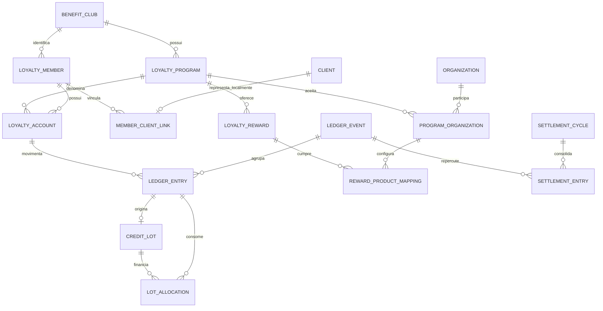

# Clubes de benefícios — arquitetura de domínio e plano de migração

**Status:** proposta para discussão  
**Escopo:** substituição gradual do domínio atual de cashback por um domínio de fidelidade capaz de operar cashback ou pontos, com conta única e uso entre organizações participantes.  
**Modelo atual de referência:** `services/drizzle/schema/cashback-programs.ts`

---

## 1. Contexto

O modelo atual usa as mesmas tabelas e os mesmos cálculos para cashback e pontos. A distinção `DINHEIRO | PONTOS` funciona principalmente como terminologia de apresentação; o saldo, o acúmulo, o resgate e a expiração usam a mesma quantidade em `doublePrecision`.

Além da ambiguidade da unidade, o modelo atual é estritamente organizacional:

- programa, cliente, saldo, transação e recompensa pertencem a uma organização;
- o código presume, em diversos fluxos, um único programa ativo por organização;
- a invariável de programa único não é garantida por constraint no banco;
- a identidade do cliente é local à organização;
- um saldo adquirido em uma organização não pode ser consumido corretamente em outra;
- o histórico e o estado operacional estão misturados: transações de acúmulo têm `valorRestante` e `status` alterados pelo FIFO, expiração e estorno;
- `organizacaoId` repetido em entidades filhas não garante, por FK, que programa, cliente, venda, produto e recompensa pertençam ao mesmo tenant.

O novo domínio deve tratar cashback e pontos como unidades economicamente diferentes e deve representar explicitamente o clube, o programa, suas organizações participantes, o membro compartilhado, a conta única, o ledger de fidelidade e a compensação entre organizações.

---

## 2. Decisões já tomadas

1. Uma organização participa voluntariamente de um programa.
2. O saldo adquirido em uma organização participante pode ser utilizado em qualquer outra organização participante do mesmo programa.
3. O consumidor enxerga uma única conta e um único saldo no clube.
4. Um programa opera exclusivamente com cashback ou exclusivamente com pontos; não opera as duas unidades simultaneamente.
5. As regras e as recompensas são definidas pelo programa e não variam por organização.
6. A identidade compartilhada do membro é baseada em telefone verificado.
7. A compensação econômica entre organizações faz parte do domínio desde o início.
8. A liquidação financeira da compensação é configurável e pode começar manualmente.
9. O caso mono-organização não é um modelo alternativo: é um clube com uma única organização participante.

---

## 3. Objetivos

- Dar semântica própria a cashback e pontos.
- Permitir conta e saldo únicos entre organizações participantes.
- Preservar a origem organizacional de cada crédito e de cada resgate.
- Consumir créditos por FIFO com abatimento parcial e rastreabilidade exata.
- Tornar o histórico de fidelidade imutável e auditável.
- Permitir reconstrução e verificação do saldo.
- Apurar posições financeiras entre organizações.
- Manter as recompensas uniformes no programa.
- Migrar gradualmente, sem big bang e com possibilidade de rollback durante o rollout.
- Preservar referências a vendas, campanhas, operadores e transações legadas.

## 4. Fora de escopo inicial

- Mais de uma unidade ativa no mesmo programa.
- Regras ou recompensas diferentes por organização participante.
- Marketplace aberto de parceiros externos.
- Conversão de pontos entre programas ou clubes.
- Compra ou transferência de saldo entre membros.
- Liquidação bancária automática no primeiro rollout.
- Transformar todos os clientes do CRM em uma identidade global da plataforma.

---

## 5. Linguagem do domínio

### Clube de benefícios (`benefitClub`)

Identidade institucional durável que governa participantes, membros e programas. Representa a marca e o acordo da rede, não uma unidade operacional.

### Programa de fidelidade (`loyaltyProgram`)

Contrato econômico vigente do clube. Define a unidade, as políticas de ganho, resgate e expiração e o catálogo de recompensas. Um clube pode preservar programas encerrados, mas possui no máximo um programa ativo.

### Organização participante (`loyaltyProgramOrganization`)

Organização autorizada a gerar saldo e aceitar resgates durante um período de participação. No primeiro escopo, toda participante exerce os dois papéis.

### Membro do clube (`loyaltyMember`)

Identidade do consumidor no escopo do clube, reconhecida por telefone verificado. Não substitui o cadastro local do cliente em cada organização.

### Vínculo local do membro (`loyaltyMemberClientLink`)

Associação entre um membro do clube e um registro de `clients` pertencente a uma organização participante.

### Conta de fidelidade (`loyaltyAccount`)

Conta única do membro em um programa. Sua unidade é definida pelo programa e seu saldo é uma projeção do ledger.

### Evento de fidelidade (`loyaltyLedgerEvent`)

Intenção de negócio imutável, como acúmulo, resgate, expiração, ajuste ou reversão. Agrupa os lançamentos e preserva idempotência, origem e causalidade.

### Lançamento de fidelidade (`loyaltyLedgerEntry`)

Alteração imutável, positiva ou negativa, na conta de fidelidade. Correções geram novos lançamentos; lançamentos anteriores nunca são editados.

### Lote de crédito (`loyaltyCreditLot`)

Crédito positivo com quantidade original, organização emissora e eventual data de expiração. É a unidade consumida pelo FIFO.

### Alocação de lote (`loyaltyLotAllocation`)

Registro imutável que vincula parte de um lançamento de débito a um lote de crédito. Permite consumo parcial e demonstra exatamente quais créditos financiaram cada resgate ou expiração.

### Recompensa (`loyaltyReward`)

Benefício fixo, definido no catálogo do programa. Em pontos, possui custo em pontos e valor de compensação. Seu mapeamento para produtos locais é operacional e não altera a definição comercial.

### Compensação (`loyaltySettlementEntry`)

Posição econômica entre o fundo do programa e uma organização participante, originada por emissão, resgate, expiração, ajuste ou reversão.

### Ciclo de compensação (`loyaltySettlementCycle`)

Período no qual posições econômicas são consolidadas e, opcionalmente, liquidadas financeiramente.

---

## 6. Visão geral do modelo



### Separação essencial

- O clube define governança e identidade compartilhada.
- O programa define o contrato econômico.
- A participação define onde o contrato pode ser executado.
- A conta pertence ao membro e ao programa, não a uma organização.
- O lançamento registra a organização operacional envolvida.
- O lote registra a organização que financiou o crédito.
- A alocação conecta a organização emissora à organização que realizou o resgate.

---

## 7. Unidade de valor

### 7.1 Cashback

- O programa informa `tipo = CASHBACK` e `moeda = BRL`.
- A quantidade deve ser armazenada em centavos inteiros (`bigint`) ou `numeric` com escala fixa.
- Um centavo de cashback corresponde a um centavo de benefício e compensação.
- Formatação monetária é apresentação; não altera o valor persistido.

### 7.2 Pontos

- O programa informa `tipo = PONTOS`.
- Pontos não têm equivalência monetária intrínseca.
- A quantidade deve ser inteira, salvo decisão explícita de permitir pontos fracionários.
- Cada recompensa define separadamente:
  - `custoPontos`: quantidade debitada da conta;
  - `valorCompensacaoCentavos`: valor devido à organização que entrega o benefício.
- Não deve existir cálculo implícito do tipo `1 ponto = R$ 1`.

### 7.3 Invariantes da unidade

- A unidade da conta é herdada do programa e não pode ser alterada.
- Um evento não pode movimentar contas de unidades diferentes.
- Trocar um clube de pontos para cashback exige encerrar o programa anterior e criar outro.
- Conversão de saldo entre programas, se um dia existir, será um evento explícito com política própria.

---

## 8. Estrutura sugerida de persistência

Os nomes abaixo são conceituais. Ao implementar, nomes de modules, funções e tipos permanecem em inglês; campos que trafegam como dados permanecem em português, conforme `CLAUDE.md`.

### 8.1 `benefitClubs`

Campos centrais:

- `id`
- `titulo`
- `descricao`
- `organizacaoGestoraId`
- `ativo`
- `configuracaoCompensacao`
- `dataInsercao`
- `dataAtualizacao`

`organizacaoGestoraId` identifica quem administra o clube. Isso não significa que a gestora financia todos os benefícios.

### 8.2 `loyaltyPrograms`

Campos centrais:

- `id`
- `clubeId`
- `titulo`
- `tipo`: `CASHBACK | PONTOS`
- `moeda`: `BRL | null`
- `status`: `RASCUNHO | ATIVO | ENCERRADO`
- `vigenciaInicio`
- `vigenciaFim`
- configurações uniformes de ganho, resgate e expiração
- `dataInsercao`

Constraints:

- índice único parcial garantindo no máximo um programa `ATIVO` por clube;
- `moeda` obrigatória para cashback e nula para pontos;
- configuração imutável depois de existirem lançamentos, salvo campos estritamente editoriais.

### 8.3 `loyaltyProgramOrganizations`

Campos centrais:

- `id`
- `programaId`
- `organizacaoId`
- `status`: `PENDENTE | ATIVA | SUSPENSA | ENCERRADA`
- `permiteAcumulo`
- `permiteResgate`
- `vigenciaInicio`
- `vigenciaFim`
- `termosVersao`
- `termosAceitosEm`
- `dataInsercao`

Constraints:

- unicidade por `(programaId, organizacaoId)`;
- novos eventos exigem participação ativa na data do evento;
- suspender uma organização bloqueia novas operações sem apagar o histórico.

Os booleanos de papel deixam uma extensão futura possível, mas no primeiro rollout ambos devem ser verdadeiros para todas as participantes.

### 8.4 `loyaltyMembers`

Campos centrais:

- `id`
- `clubeId`
- `status`: `PROVISORIO | ATIVO | BLOQUEADO | MESCLADO`
- `membroDestinoId`, quando mesclado
- `dataInsercao`
- `dataAtualizacao`

O membro é escopado ao clube. A mesma pessoa pode participar de clubes independentes sem que a plataforma force uma identidade global entre eles.

### 8.5 `loyaltyMemberIdentities`

Campos centrais:

- `id`
- `clubeId`
- `membroId`
- `tipo`: inicialmente apenas `TELEFONE`
- `valorNormalizado`: telefone em E.164
- `verificadoEm`
- `revogadoEm`
- `dataInsercao`

Constraint principal:

- um telefone ativo e verificado identifica no máximo um membro por clube.

A constraint pode ser um índice único parcial em `(clubeId, tipo, valorNormalizado)` para identidades verificadas e não revogadas.

### 8.6 `loyaltyIdentityVerificationChallenges`

Campos centrais:

- `id`
- `clubeId`
- `telefoneNormalizado`
- `codigoHash`
- `canal`: `SMS | WHATSAPP`
- `expiracaoData`
- `tentativas`
- `consumidoEm`
- `organizacaoSolicitanteId`
- `dataInsercao`

O código nunca é persistido em texto aberto. O fluxo deve possuir expiração curta, limite de tentativas, rate limit por telefone/IP/dispositivo e trilha de auditoria.

### 8.7 `loyaltyMemberClientLinks`

Campos centrais:

- `id`
- `clubeId`
- `membroId`
- `organizacaoId`
- `clienteId`
- `origem`: `VERIFICACAO_TELEFONE | MIGRACAO | ADMINISTRADOR`
- `dataInsercao`

Constraints:

- um cliente local só pode estar ligado a um membro do mesmo clube;
- a organização do cliente deve ser participante de algum programa aplicável do clube;
- unicidade por `(clubeId, clienteId)`.

### 8.8 `loyaltyAccounts`

Campos centrais:

- `id`
- `programaId`
- `membroId`
- `status`: `ATIVA | BLOQUEADA | ENCERRADA`
- `saldoDisponivel`: projeção materializada
- `totalAcumulado`: projeção materializada
- `totalResgatado`: projeção materializada
- `versao`: controle de concorrência, se adotado
- `dataInsercao`
- `dataAtualizacao`

Constraint principal:

- unicidade por `(programaId, membroId)`.

Os totais materializados aceleram leituras, mas não são a fonte primária da verdade.

### 8.9 `loyaltyLedgerEvents`

Campos centrais:

- `id`
- `programaId`
- `contaId`
- `tipo`: `ACUMULO | RESGATE | EXPIRACAO | AJUSTE | REVERSAO | MIGRACAO`
- `organizacaoOperacionalId`
- `eventoOrigemId`, para reversões
- `origemTipo`: `VENDA | CAMPANHA | RECOMPENSA | CRON | ADMINISTRADOR | MIGRACAO`
- `origemId`
- `idempotencyKey`
- referências opcionais a venda, campanha, recompensa e operador
- `metadados`
- `ocorridoEm`
- `dataInsercao`

Constraints:

- unicidade por `(programaId, idempotencyKey)`;
- reversão referencia um evento existente do mesmo programa e conta;
- a organização operacional deve ser participante válida na data efetiva, exceto eventos administrativos ou de migração explicitamente permitidos.

### 8.10 `loyaltyLedgerEntries`

Campos centrais:

- `id`
- `eventoId`
- `contaId`
- `quantidade`: positiva para crédito, negativa para débito
- `dataInsercao`

Lançamentos são append-only. Não possuem `valorRestante`, nem um status que seja alterado por consumo posterior.

### 8.11 `loyaltyCreditLots`

Campos centrais:

- `id`
- `lancamentoCreditoId`
- `contaId`
- `organizacaoEmissoraId`
- `quantidadeOriginal`
- `expiracaoData`
- `dataCredito`
- `dataInsercao`

Cada lançamento positivo que gera saldo consumível cria exatamente um lote. A quantidade restante é derivada das alocações; uma projeção materializada opcional pode existir para desempenho.

### 8.12 `loyaltyLotAllocations`

Campos centrais:

- `id`
- `loteId`
- `lancamentoDebitoId`
- `quantidade`
- `alocacaoOrigemId`, quando for reversão de uma alocação
- `tipo`: `CONSUMO | EXPIRACAO | REVERSAO`
- `dataInsercao`

Constraints:

- quantidade sempre positiva;
- o débito e o lote pertencem à mesma conta;
- a soma líquida das alocações de um lote não pode exceder `quantidadeOriginal`;
- a soma das alocações de consumo de um débito deve corresponder ao módulo da quantidade debitada.

### 8.13 `loyaltyRewards`

Campos centrais:

- `id`
- `programaId`
- `titulo`
- `descricao`
- `imagemCapaUrl`
- `ativo`
- `custoPontos`, obrigatório somente para pontos
- `valorCashbackCentavos`, se o catálogo permitir recompensa de valor fixo em cashback
- `valorCompensacaoCentavos`
- `dataInsercao`
- `dataAtualizacao`

A definição comercial é única para todo o programa.

### 8.14 `loyaltyRewardProductMappings`

Campos centrais:

- `id`
- `recompensaId`
- `participacaoId`
- `produtoId`
- `produtoVarianteId`
- `ativo`
- `dataInsercao`

Esse mapeamento permite que a mesma recompensa global baixe produtos locais com IDs distintos. Ele não permite alterar custo, título ou valor de compensação por organização.

### 8.15 `loyaltySettlementEntries`

Campos centrais:

- `id`
- `eventoId`
- `organizacaoId`
- `tipo`: `EMISSAO | RESGATE | EXPIRACAO | AJUSTE | REVERSAO`
- `direcao`: `A_PAGAR | A_RECEBER`
- `valorCentavos`
- `cicloId`
- `dataCompetencia`
- `dataInsercao`

Lançamentos de compensação também são imutáveis.

### 8.16 `loyaltySettlementCycles`

Campos centrais:

- `id`
- `clubeId`
- `periodoInicio`
- `periodoFim`
- `status`: `ABERTO | FECHADO | LIQUIDADO | CANCELADO`
- `fechadoEm`
- `liquidadoEm`
- `dataInsercao`

O ciclo consolida os valores líquidos por organização. Fechar um ciclo impede que novos lançamentos sejam atribuídos retroativamente a ele; correções entram no ciclo seguinte.

---

## 9. Como o FIFO funciona

O FIFO continua permitindo abatimento parcial por registro de acúmulo, mas deixa de alterar o acúmulo original. O estado de consumo passa a ser representado por alocações imutáveis.

### 9.1 Ordenação

Para um débito, os lotes elegíveis são ordenados por:

1. `expiracaoData ASC`, com datas nulas por último;
2. `dataCredito ASC`;
3. `id ASC`, como desempate determinístico.

Embora seja chamado de FIFO, priorizar a menor expiração é tecnicamente FEFO. Essa é a semântica já utilizada pelo código atual e reduz perdas do membro. O nome da implementação pode refletir isso, desde que a regra seja documentada.

### 9.2 Saldo restante do lote

```text
saldoRestanteDoLote = quantidadeOriginal
                     - soma(alocações CONSUMO)
                     - soma(alocações EXPIRACAO)
                     + soma(alocações REVERSAO)
```

O lote original permanece imutável. Uma projeção `quantidadeDisponivel` pode ser atualizada na mesma transação apenas para acelerar seleção, desde que seja reconciliável com as alocações.

### 9.3 Exemplo de consumo parcial

Conta com 120 pontos:

| Lote | Origem | Expiração | Original | Disponível antes |
|---|---|---:|---:|---:|
| L1 | Organização A | 10/09 | 50 | 50 |
| L2 | Organização B | 20/09 | 40 | 40 |
| L3 | Organização A | 30/09 | 30 | 30 |

Resgate de 70 pontos na Organização B:

| Alocação | Lote | Débito | Quantidade |
|---|---|---|---:|
| A1 | L1 | D1 | 50 |
| A2 | L2 | D1 | 20 |

Resultado:

| Lote | Disponível depois |
|---|---:|
| L1 | 0 |
| L2 | 20 |
| L3 | 30 |

O lançamento `D1` registra `-70`. As alocações demonstram que 50 unidades foram financiadas pela Organização A e 20 pela Organização B. O mesmo detalhamento alimenta a compensação.

### 9.4 Operação transacional

Um resgate deve ocorrer em uma única transação de banco:

1. validar programa, participação, membro, conta e recompensa;
2. adquirir lock da conta (`SELECT ... FOR UPDATE`) ou usar controle de versão equivalente;
3. selecionar lotes elegíveis na ordem definida;
4. calcular o saldo restante de cada lote;
5. recusar o resgate se o total for insuficiente;
6. inserir o evento de resgate;
7. inserir o lançamento negativo;
8. inserir uma ou mais alocações parciais;
9. inserir as posições de compensação;
10. atualizar a projeção da conta e, se existir, a projeção dos lotes;
11. confirmar a transação.

O lock por conta serializa débitos concorrentes do mesmo membro. A `idempotencyKey` evita que retries criem o mesmo resgate duas vezes.

### 9.5 Expiração

Expiração usa o mesmo mecanismo de débito e alocação:

- localizar lotes vencidos com saldo remanescente;
- criar evento `EXPIRACAO`;
- criar lançamento negativo pela parte ainda disponível;
- criar alocação `EXPIRACAO` contra o lote;
- atualizar projeções;
- criar eventual liberação da provisão econômica da organização emissora.

O lote não recebe `status = EXPIRADO` nem `valorRestante = 0`; o fato da expiração está no ledger.

### 9.6 Reversão de resgate

Uma reversão referencia o evento de resgate original:

- cria evento `REVERSAO` e lançamento positivo;
- cria alocações `REVERSAO` referenciando as alocações consumidas;
- reverte as posições econômicas correspondentes;
- nunca apaga o débito ou suas alocações.

Política recomendada: créditos restaurados preservam os lotes e as expirações originais. Se o lote já estiver vencido no momento da reversão, a parte restaurada não volta ao saldo disponível; o histórico permanece correto e não se cria validade artificial.

### 9.7 Reversão de acúmulo já consumido

Cancelar uma venda cujo crédito já foi usado exige uma política de produto. As opções são:

1. impedir o cancelamento até que os resgates dependentes sejam revertidos, comportamento mais próximo do atual;
2. permitir saldo negativo e criar um débito de ajuste;
3. permitir uma dívida não utilizável, mantendo saldo disponível em zero até compensação futura.

Recomendação inicial: preservar a opção 1 durante a migração. Saldo negativo ou dívida de fidelidade deve ser introduzido apenas como decisão explícita posterior.

---

## 10. Compensação entre organizações

### 10.1 Princípio

- A organização emissora financia o saldo que gerou.
- A organização resgatadora é compensada pelo benefício que entregou.
- O clube apura as posições.
- A liquidação financeira pode ser manual, automática ou absorvida pela organização gestora.

Compensação econômica e liquidação financeira são conceitos separados. A primeira é obrigatória; a segunda é configurável.

### 10.2 Cashback

Em um resgate de R$ 10:

- os lotes consumidos identificam quanto foi emitido por cada organização;
- cada emissora recebe posição `A_PAGAR` proporcional à quantidade consumida de seus lotes;
- a organização resgatadora recebe posição `A_RECEBER` de R$ 10;
- se emissora e resgatadora forem a mesma organização, as posições se anulam no fechamento líquido.

### 10.3 Pontos

Pontos não definem dinheiro. A recompensa define `valorCompensacaoCentavos`.

Exemplo:

- recompensa: café por 500 pontos;
- valor de compensação: R$ 8;
- 300 pontos vieram da Organização A;
- 200 pontos vieram da Organização B;
- resgate ocorreu na Organização C.

Rateio:

- A financia 60% de R$ 8;
- B financia 40% de R$ 8;
- C recebe R$ 8.

Arredondamentos devem ser determinísticos em centavos. O resíduo é atribuído à maior alocação; em empate, ao menor ID de alocação.

### 10.4 Modos de liquidação

- `CENTRALIZADA`: a gestora absorve posições e paga participantes.
- `COMPENSACAO_ENTRE_PARTICIPANTES`: organizações pagam ou recebem o líquido do ciclo.
- `APURACAO_APENAS`: posições são calculadas, sem automação financeira.

Recomendação de rollout: começar com `APURACAO_APENAS`, validar relatórios por pelo menos dois ciclos e só então habilitar uma liquidação financeira.

---

## 11. Identidade por telefone verificado

### 11.1 Identificador

- O telefone é normalizado para E.164 antes de qualquer busca ou persistência.
- O telefone só se torna identidade depois de um desafio OTP concluído.
- Ter o mesmo telefone preenchido em dois registros de `clients` não autoriza merge automático.
- A prova de posse é escopada ao clube, não à organização onde foi realizada.
- Um telefone verificado e ativo pertence a no máximo um membro por clube.

`clients.whatsappUserId` continua útil para comunicação e identidade no contexto da Meta, mas não substitui a verificação do telefone no clube.

### 11.2 Fluxo de entrada

1. consumidor informa o telefone em uma organização participante;
2. sistema normaliza para E.164 e cria desafio;
3. código é entregue por SMS ou WhatsApp;
4. consumidor confirma o código;
5. sistema procura identidade verificada no clube;
6. se existir, recupera o membro e sua conta única;
7. se não existir, cria membro, identidade verificada e conta;
8. vincula o `client` local ao membro;
9. registra organização, canal e momento da verificação.

### 11.3 Segurança e recuperação

- armazenar apenas hash do OTP;
- prazo curto de expiração;
- limite de tentativas e reenvios;
- rate limit por telefone, IP e dispositivo;
- mensagens que não revelem se o telefone já possui conta;
- trilha de auditoria de verificações, trocas e revogações;
- troca de telefone exige prova no telefone atual ou fluxo assistido;
- números reciclados não devem transferir automaticamente uma conta antiga;
- merges administrativos exigem justificativa e são auditáveis.

### 11.4 Membros provisórios da migração

Clientes legados começam como membros `PROVISORIO`. O telefone existente no CRM é um indício, não uma identidade verificada.

Na primeira verificação:

- se não houver membro verificado para o telefone, o membro provisório é ativado;
- se já houver membro verificado, ocorre uma operação explícita de merge;
- o merge preserva os vínculos e transfere economicamente o saldo por eventos de migração/reversão, sem reatribuir silenciosamente lançamentos históricos;
- o membro provisório fica `MESCLADO` e aponta para o membro canônico.

---

## 12. Estratégia de migração

A migração deve ser aditiva, observável e reversível até o cutover final.

### Fase 0 — inventário e decisões

1. Identificar organizações que formarão cada clube.
2. Listar todos os programas existentes por organização.
3. Detectar organizações com zero, um ou múltiplos programas ativos.
4. Comparar configurações dos programas que serão consolidados.
5. Resolver divergências de regras e recompensas antes do agrupamento.
6. Definir organização gestora e modo inicial de liquidação.
7. Definir data de corte para iniciar a compensação econômica.
8. Quantificar saldos sem transações de origem e usos do bypass FIFO.

Nenhum programa multi-organização deve ser criado automaticamente quando as configurações existentes divergirem.

### Fase 1 — fundação aditiva

1. Criar novos enums em `services/drizzle/schema/enums.ts`.
2. Criar schema de domínio, preferencialmente `services/drizzle/schema/benefits-clubs.ts`.
3. Exportar pelo barrel de schema.
4. Gerar migration com `npm run db:generate`.
5. Revisar manualmente o SQL gerado.
6. Adicionar constraints, índices parciais e índices de seleção FIFO.
7. Manter todas as tabelas legadas intactas.

Índices mínimos:

- programa ativo por clube;
- participação por programa/organização;
- identidade verificada por clube/telefone;
- conta por programa/membro;
- evento por programa/idempotência;
- lotes por conta/expiração/data/id;
- alocações por lote e por débito;
- posições por organização/ciclo.

### Fase 2 — backfill estrutural

1. Criar clubes e mapear as organizações participantes.
2. Criar programa canônico por clube.
3. Converter `terminologia`:
   - `DINHEIRO` → `CASHBACK`/`BRL`;
   - `PONTOS` → `PONTOS`/sem moeda.
4. Migrar políticas uniformes de acúmulo, expiração e resgate.
5. Migrar recompensas para catálogo global.
6. Criar mapeamentos locais de produto/variante por participante.
7. Criar membros provisórios e vínculos com clientes locais.
8. Criar uma conta por programa e membro provisório.

Para um clube inicialmente mono-organização, o backfill cria uma única participação. Isso exercita o mesmo modelo que será usado por franquias.

### Fase 3 — classificação da qualidade do ledger legado

Cada conta deve ser classificada antes de migrar seu saldo.

#### Classe A — histórico reconciliável

Critérios:

- todo acúmulo possui origem identificável;
- `valorRestante` está entre zero e `valor`;
- metadados `consumoFifo` dos resgates referenciam transações existentes;
- soma das alocações históricas explica os valores consumidos;
- soma dos remanescentes explica o saldo materializado, dentro da tolerância definida;
- expirações e cancelamentos não geram saldo negativo.

Migração:

- cada transação de acúmulo vira evento, lançamento positivo e lote;
- `valorRestante` é reconstruído por alocações, não copiado como estado mutável;
- resgates viram eventos, débitos e alocações importadas de `consumoFifo`;
- expirações e cancelamentos viram eventos compensatórios;
- IDs legados ficam preservados em `metadados.legacyTransactionId` ou coluna dedicada.

#### Classe B — histórico não reconciliável

Exemplos:

- saldo importado sem transações de acúmulo;
- bypass FIFO;
- resgate sem `consumoFifo` suficiente;
- divergência entre saldo e remanescentes;
- transações órfãs ou tenant inconsistente.

Migração segura:

- criar evento `MIGRACAO` na data de corte;
- criar um lote de abertura igual ao saldo disponível autoritativo;
- atribuir como emissora a organização proprietária do saldo legado;
- definir expiração de abertura segundo decisão explícita, sem inventar datas históricas;
- copiar transações antigas para uma área de auditoria ou metadados de referência, sem efeito no novo saldo;
- registrar motivo e evidências da classificação.

Não se deve fabricar alocações históricas para fazer a conta fechar.

### Fase 4 — backfill verificável

O script deve:

- rodar em dry-run por padrão;
- aceitar `--apply` para persistência;
- aceitar filtros por `--orgId`, `--clubId` e lote de IDs;
- processar em chunks e permitir retomada;
- usar idempotency keys determinísticas;
- gerar relatório por conta e por classificação;
- interromper a conta, não o lote inteiro, quando encontrar inconsistência;
- nunca corrigir silenciosamente o legado.

Verificações mínimas:

```text
saldoLegadoDisponivel == saldoNovoDisponivel
totalCreditos - totalDebitos == saldoNovoContabil
somaRestanteLotes == saldoNovoDisponivel
somaAlocacoesDebito == modulo(debitosConsumiveis)
nenhumLoteComSaldoNegativo
nenhumaContaDuplicadaPorProgramaEMembro
nenhumTelefoneNaoVerificadoFundiuMembros
```

### Fase 5 — shadow mode

1. Introduzir um único module de fidelidade para creditar, debitar, expirar e reverter.
2. Manter o legado como fonte primária temporária.
3. Após cada operação legada, escrever também no novo ledger com a mesma idempotency key.
4. Comparar saldos, lotes e resultados FIFO de forma assíncrona.
5. Alertar divergências sem afetar a operação do cliente.
6. Rodar pelo menos um ciclo completo de expiração e estorno em shadow mode.

O dual-write deve ficar concentrado no module de fidelidade. Vendas, campanhas, POI e cron não devem implementar duas escritas independentemente.

### Fase 6 — cutover de leitura

Ordem recomendada:

1. consultas internas e relatórios;
2. exibição de saldo ao cliente;
3. consulta de recompensas;
4. simulação de resgate;
5. resgate efetivo;
6. acúmulo por vendas;
7. bônus de campanhas;
8. expiração e estornos.

Cada etapa deve possuir feature flag por clube. Em caso de divergência, a leitura pode retornar temporariamente ao legado enquanto o novo ledger continua recebendo shadow writes.

### Fase 7 — cutover de escrita

1. Tornar o novo ledger a fonte primária.
2. Projetar o resultado para tabelas legadas somente enquanto houver consumidores antigos.
3. Bloquear novos caminhos que escrevam diretamente em `cashbackProgramBalances` e `cashbackProgramTransactions`.
4. Remover gradualmente dual-write e projeção reversa.
5. Manter tabelas legadas em modo somente leitura durante a janela de auditoria.

### Fase 8 — ativação multi-organização

1. Ativar participação cruzada somente para clubes reconciliados.
2. Exigir telefone verificado antes de expor ou usar saldo compartilhado.
3. Começar a compensação em `APURACAO_APENAS`.
4. Comparar por dois ciclos:
   - saldo emitido por organização;
   - saldo resgatado em outra organização;
   - posição líquida;
   - expirações e reversões;
   - custo das recompensas.
5. Após validação financeira, fechar ciclos e habilitar o modo de liquidação escolhido.

### Fase 9 — retirada do legado

1. Confirmar ausência de leitores e escritores legados.
2. Exportar snapshot final para auditoria.
3. Remover relações e tipos `cashback*` dos consumers.
4. Remover jobs antigos de expiração e ressincronização.
5. Renomear mensagens, campanhas, analytics e UI para fidelidade/unidade correta.
6. Dropar tabelas legadas apenas em migration posterior e independente.

---

## 13. Estratégia para clubes de franquias existentes

Quando várias organizações atuais forem agrupadas em um clube:

1. escolher o programa canônico;
2. validar que tipo, regras e recompensas são equivalentes;
3. criar participações para todas as organizações;
4. migrar clientes como membros provisórios separados;
5. não somar saldos apenas porque telefones textuais coincidem;
6. consolidar contas somente após verificação do telefone;
7. preservar a organização emissora em todos os lotes migrados;
8. iniciar compensação financeira somente na data de corte.

Saldos legados remanescentes podem financiar resgates futuros em outras organizações. Portanto, seus lotes precisam de uma organização emissora mesmo quando forem criados como lotes de abertura.

---

## 14. Interface do module de fidelidade

Todos os chamadores — vendas, campanhas, POI, PDV, cron e administração — devem atravessar uma única seam. A interface conceitual deve oferecer operações de negócio, não CRUD genérico:

- localizar ou verificar membro;
- obter conta e saldo;
- simular ganho;
- creditar ganho;
- listar recompensas disponíveis;
- simular resgate;
- efetivar resgate;
- expirar lotes;
- reverter evento;
- reconciliar conta;
- apurar ciclo de compensação.

A implementation concentra:

- validação de participação;
- idempotência;
- lock e concorrência;
- FIFO/FEFO;
- lançamentos e alocações;
- projeções;
- compensação;
- auditoria.

O module é deep porque os chamadores não precisam conhecer tabelas, sequência de writes, seleção de lotes ou cálculo de compensação.

---

## 15. Concorrência e consistência

- Operações que alteram uma conta devem usar transação de banco.
- Débitos concorrentes devem ser serializados por lock da conta ou versão otimista com retry.
- Seleção e alocação de lotes devem ocorrer na mesma transação.
- Idempotência deve ser protegida por constraint, não apenas consulta prévia.
- Projeções de saldo devem ser atualizadas atomicamente com o ledger.
- Jobs devem usar paginação e locks compatíveis com múltiplos workers, por exemplo `FOR UPDATE SKIP LOCKED` quando apropriado.
- Toda referência organizacional usada em uma operação deve ser validada contra a participação do programa.
- Constraints ou chaves compostas devem impedir relações cross-tenant inválidas quando a modelagem permitir.

---

## 16. Observabilidade e reconciliação

Métricas mínimas:

- créditos e débitos por programa, organização e origem;
- saldo total e quantidade de contas;
- divergências entre projeção e ledger;
- lotes vencidos ainda disponíveis;
- débitos sem alocação completa;
- eventos idempotentes repetidos;
- membros provisórios, verificados e mesclados;
- desafios de telefone falhos ou limitados;
- posições a pagar/receber por organização;
- ciclos ainda não fechados;
- volume e valor de migrações Classe B.

Reconciliações periódicas:

1. reconstruir saldo por ledger e comparar com projeção;
2. reconstruir lote restante por alocações;
3. comparar compensação com alocações de resgate;
4. verificar que toda recompensa resgatada possui valor de compensação;
5. verificar que todo evento operacional referencia uma participação válida.

---

## 17. Testes essenciais

### Ledger e FIFO

- consumo integral de um lote;
- consumo parcial de um lote;
- consumo que atravessa múltiplos lotes;
- prioridade por expiração e desempate determinístico;
- lote sem expiração consumido por último;
- saldo insuficiente sem writes parciais;
- dois resgates concorrentes;
- retry com a mesma idempotency key;
- expiração parcial;
- reversão de resgate antes e depois da expiração original;
- cancelamento de acúmulo ainda não consumido;
- bloqueio de cancelamento de acúmulo já consumido.

### Multi-organização

- acumular em A e resgatar em B;
- bloquear organização não participante;
- bloquear participação suspensa ou fora da vigência;
- anular posições quando emissora e resgatadora forem iguais;
- ratear compensação entre múltiplas emissoras;
- arredondar centavos deterministically em pontos.

### Identidade

- normalização E.164;
- OTP válido, expirado, reutilizado e excedido;
- mesmo telefone verificado em duas organizações do mesmo clube;
- mesmo telefone em clubes diferentes;
- telefone textual coincidente sem verificação;
- merge de membro provisório;
- troca e revogação de telefone;
- concorrência de duas verificações do mesmo telefone.

### Migração

- conta Classe A totalmente reconciliada;
- conta Classe B com lote de abertura;
- script reiniciado sem duplicação;
- divergência isolada por conta;
- paridade de saldo antes/depois;
- rollback de feature flag durante shadow mode.

---

## 18. Riscos e mitigação

| Risco | Mitigação |
|---|---|
| Merge incorreto por telefone legado | Exigir OTP; legado cria membro provisório |
| Duplo gasto concorrente | Lock/versão da conta e transação única |
| Duplicação por retry | Constraint de idempotência |
| Perda de rastreabilidade no backfill | Preservar IDs legados e classificar qualidade |
| Inventar histórico FIFO | Lote de abertura para contas não reconciliáveis |
| `doublePrecision` gerar divergência | Inteiros ou `numeric` com escala fixa |
| Franquia resgatar saldo alheio sem receber | Compensação derivada das alocações |
| Catálogo global não casar com produtos locais | Mapeamento operacional por participante |
| Regra alterada reinterpretar histórico | Programa e eventos preservam snapshot/versionamento |
| Cutover amplo demais | Feature flags por clube e por capacidade |

---

## 19. Decisões pendentes

1. Canal inicial do OTP: SMS, WhatsApp ou ambos.
2. Prazo, tentativas e política de recuperação da verificação.
3. Precisão de pontos: somente inteiros ou fracionários.
4. Regra de expiração dos lotes de abertura Classe B.
5. Organização gestora e modo de liquidação de cada clube.
6. Momento da obrigação econômica: emissão, resgate ou combinação de provisão e realização.
7. Política futura para cancelamento de acúmulo já consumido.
8. Período mínimo de shadow mode e critérios quantitativos de cutover.
9. Política de retenção das tabelas legadas.

---

## 20. Recomendação de implementação

Primeiro, implementar clube, programa, participação e identidade verificada. Em seguida, implementar o ledger com lotes e alocações, ainda em contexto mono-organização. Somente depois de demonstrar paridade com o FIFO atual deve-se ativar conta compartilhada e compensação entre organizações.

Essa ordem preserva locality: identidade, participação, ledger e compensação ficam concentrados em modules próprios, enquanto vendas, campanhas, POI e PDV usam uma interface pequena de fidelidade. Também reduz o risco de usar a complexidade multi-organização para esconder divergências já existentes no saldo legado.
