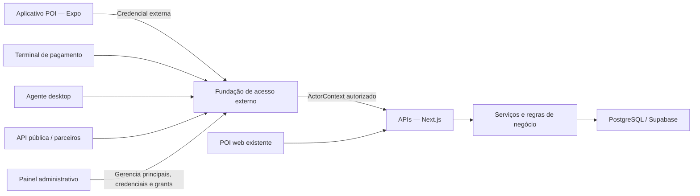

# Plano de implementação — aplicativo POI para tablets

## 1. Objetivo

Criar um aplicativo Android minimalista para tablets que reproduza o fluxo atual de Point of Interaction (POI), hoje disponível em `app/(external)/point-of-interaction/`, com maior controle sobre o dispositivo e distribuição inicial por APK, sem depender da Play Store.

O aplicativo será desenvolvido em React Native com Expo, em um repositório independente e irmão deste projeto:

```text
C:\Users\Lucas\PROJETOS\
├── recompracrm\
└── recompracrm-poi-mobile\
```

O `recompracrm` continuará responsável pelo backend, banco de dados, regras de negócio e POI web. O `recompracrm-poi-mobile` será um novo cliente das APIs da plataforma.

## 2. Resultados esperados

- APK instalável diretamente em tablets Android.
- Interface visualmente consistente com o POI web.
- Tela sempre ligada durante a operação.
- Orientação definida e barras do sistema ocultas durante o fluxo.
- Tablet associado com segurança a uma organização.
- Transações protegidas contra duplicação por falhas de rede.
- Recuperação adequada após perda de conexão, background ou reinício do aplicativo.
- Base preparada para modo kiosk estrito e integrações futuras com hardware.

## 3. Escopo inicial

### Incluído

- Projeto React Native independente com Expo e TypeScript.
- Build Android via Expo Development Build/EAS.
- Ativação e identificação individual do tablet.
- Consulta e identificação de cliente.
- Fluxo de nova transação equivalente ao POI web.
- Modos, cashback, cupons, prêmios e confirmações suportados pelo fluxo atual.
- Status de conexão e recuperação de operações interrompidas.
- Sons, feedbacks e celebrações relevantes.
- Keep awake, orientação, status bar e navigation bar.
- Registro da versão e do último acesso do dispositivo.
- APK de homologação e APK release assinado.

### Não incluído no MVP

- Publicação na Play Store ou App Store.
- Aplicativo para iOS/iPadOS.
- Operação integralmente offline.
- Sincronização offline de saldos, cupons ou resgates.
- Impressora térmica, NFC, Bluetooth ou leitor dedicado.
- Mobile Device Management (MDM).
- Bloqueio corporativo completo do Android, salvo se necessário para o piloto.

## 4. Decisões técnicas

| Tema | Decisão inicial |
| --- | --- |
| Framework | React Native com Expo |
| Navegação | Expo Router |
| Linguagem | TypeScript |
| Dados remotos | TanStack React Query + Axios |
| Validação | Zod |
| Estado do fluxo | Hook/reducer dedicado; avaliar Zustand apenas se a complexidade justificar |
| Credenciais | Expo SecureStore |
| Rede | Expo Network ou NetInfo |
| Tela ligada | Expo KeepAwake |
| Orientação | Expo Screen Orientation |
| Barras Android | Expo StatusBar + Expo NavigationBar |
| Áudio | Expo Audio |
| Animações | React Native Reanimated quando necessário |
| Build | EAS Build com perfil APK interno |
| Backend | APIs App Router no repositório `recompracrm` |

O projeto deve usar Development Build desde o início. O Expo Go não será tratado como runtime de produção, pois o projeto poderá precisar de configuração Android e módulos Kotlin próprios.

## 5. Arquitetura



O aplicativo não acessará diretamente o banco ou o Supabase. Toda operação passará pelas APIs do `recompracrm`.

## 6. Estrutura proposta para o novo repositório

```text
recompracrm-poi-mobile/
├── app/
│   ├── _layout.tsx
│   ├── index.tsx
│   ├── activation/
│   │   └── index.tsx
│   ├── operation/
│   │   └── index.tsx
│   ├── settings/
│   │   └── index.tsx
│   └── diagnostics/
│       └── index.tsx
├── src/
│   ├── api/
│   ├── components/
│   │   ├── ui/
│   │   └── poi/
│   ├── features/
│   │   ├── activation/
│   │   └── transaction/
│   ├── hooks/
│   ├── providers/
│   ├── schemas/
│   ├── storage/
│   ├── theme/
│   ├── types/
│   └── utils/
├── assets/
│   ├── fonts/
│   ├── icons/
│   ├── images/
│   └── sounds/
├── app.config.ts
├── eas.json
├── package.json
└── tsconfig.json
```

O diretório `android/` será gerado com `expo prebuild` quando houver necessidade de configuração ou código nativo. Alterações nativas permanentes devem preferencialmente ser reproduzíveis por config plugins.

## 7. Modelo de navegação e estado

Expo Router será usado para áreas de alto nível:

- ativação;
- operação;
- configurações protegidas;
- diagnóstico.

As etapas de uma transação não devem ser necessariamente rotas independentes. O fluxo principal será uma máquina de estados ou reducer tipado dentro da tela de operação:

```ts
type TransactionStep =
  | "client"
  | "mode"
  | "sale-value"
  | "coupon-selection"
  | "prize-selection"
  | "prize-confirmation"
  | "cashback"
  | "confirmation";
```

O estado deve:

- definir explicitamente quais transições são permitidas;
- impedir avanço com dados incompletos;
- preservar a transação em andamento durante interrupções recuperáveis;
- limpar dados sensíveis após conclusão ou cancelamento;
- impedir que o botão Voltar saia acidentalmente da operação;
- permitir cancelamento por uma ação deliberada e confirmada.

## 8. Design e experiência em tablet

O design web será a referência visual, mas os componentes serão reconstruídos com primitives React Native. Não serão portados componentes HTML, Radix, shadcn ou dependências do DOM.

Devem ser extraídos do produto atual:

- paleta e contrastes;
- famílias e pesos tipográficos;
- escala de espaçamento;
- raios e elevações;
- iconografia e assets da marca;
- sons e animações;
- hierarquia visual de cada etapa;
- mensagens e textos em português brasileiro.

O aplicativo terá tokens próprios e centralizados. O layout deve considerar primeiro o modelo de tablet escolhido para o piloto e definir explicitamente:

- orientação landscape ou portrait;
- resolução mínima suportada;
- áreas seguras;
- tamanho mínimo de toque;
- teclado numérico e comportamento do teclado virtual;
- legibilidade à distância de operação esperada.

Antes da implementação completa, cada tela principal deve ser comparada visualmente com sua equivalente web.

## 9. Fundação de acesso externo

O aplicativo não reutilizará diretamente a sessão web baseada em cookies. Entretanto, a autenticação não será modelada como uma tabela específica de dispositivos POI. O mobile será o primeiro consumidor de uma fundação geral de acesso externo que também deverá suportar:

- aplicativo para terminais de pagamento;
- agente desktop para controle de periféricos;
- service accounts de integrações de clientes;
- API keys para parceiros e API pública;
- OAuth 2.1 no futuro, caso aplicações de terceiros sejam autorizadas por múltiplas organizações.

A fundação separará quatro conceitos: **aplicação cliente**, **principal técnico**, **credencial** e **autorização**.

**Convenção de nomenclatura:** as colunas das tabelas `access_*` seguem o padrão do restante do schema — português em snake_case, mantendo apenas termos técnicos consolidados sem tradução natural (`scope`, `status`, `hash`), no mesmo espírito de `stripe_subscription_status`. Essa decisão vale para todas as tabelas abaixo e não deve ser revisitada por tabela.

### 9.1 Aplicações clientes

Uma aplicação cliente representa o software conhecido pela plataforma, e não uma instalação específica.

Exemplos:

```text
RECOMPRA_POI_MOBILE
RECOMPRA_PAYMENT_TERMINAL
RECOMPRA_DESKTOP_AGENT
PARTNER_API_CLIENT
CUSTOMER_ERP_INTEGRATION
```

Tabela candidata:

```text
access_clients
├── id
├── codigo
├── nome
├── categoria
├── primeira_parte
├── escopos_permitidos
├── status
├── configuracao
├── data_insercao
└── data_atualizacao
```

Categorias iniciais:

```ts
type AccessClientCategory =
  | "FIRST_PARTY_MOBILE"
  | "FIRST_PARTY_WEB_KIOSK"
  | "FIRST_PARTY_DESKTOP"
  | "PAYMENT_TERMINAL"
  | "EXTERNAL_SERVER"
  | "PARTNER_APPLICATION";
```

**Teto de escopos por cliente:** `escopos_permitidos` define o conjunto máximo de scopes que qualquer principal daquele cliente pode receber. Nenhum grant pode exceder esse teto, independentemente do fluxo administrativo que o conceda. Isso protege contra má configuração (um tablet POI jamais poderá receber `sales:*`, mesmo por erro de um administrador) e é o que tornará o self-checkout seguro no futuro: `RECOMPRA_SELF_CHECKOUT` terá um teto diferente de `RECOMPRA_POI_MOBILE`, ainda que ambos usem principals `DEVICE`. O teto é uma coluna própria — e não parte de `configuracao` — justamente por ser informação usada em decisão de autorização.

### 9.2 Principais técnicos

O principal técnico representa o ator concreto autorizado a realizar chamadas: um tablet, uma maquininha, um agente desktop ou uma conta de serviço.

```text
access_principals
├── id
├── access_client_id
├── organizacao_id
├── loja_id
├── tipo
├── nome
├── referencia_externa
├── status
├── metadados
├── ultimo_acesso
├── data_insercao
├── data_atualizacao
└── data_revogacao
```

```ts
type AccessPrincipalType = "DEVICE" | "DESKTOP_AGENT" | "SERVICE_ACCOUNT";
```

Para o mobile, cada tablet será um principal `DEVICE` associado ao cliente `RECOMPRA_POI_MOBILE`. `metadados` poderá guardar informações não essenciais à autorização, como fabricante, modelo, versão do Android e versão do aplicativo. Informações usadas em constraints, joins ou políticas devem ganhar colunas próprias em vez de permanecer no JSON.

**Um principal por organização (modelo de instalação):** `organizacao_id` é `NOT NULL` e essa rigidez é deliberada. Um cliente autorizado por N organizações gera N principals — o mesmo modelo de GitHub App e suas installations. Todo `ExternalActorContext` é, portanto, inequivocamente single-tenant, o que é a base da segurança de `requireExternalScope` e da derivação de organização pelo principal. Essa coluna **não deve** se tornar nullable para acomodar parceiros multi-organização; o futuro OAuth (§9.9) adicionará registros de consentimento que *produzem* principals por organização, sem alterar o modelo de tenancy.

**Vínculo com loja/local:** `loja_id` nasce como coluna própria e nullable. Para o self-checkout, o vínculo com a loja será a constraint primária de um terminal — relatórios farão join por ela — e, pela regra acima, isso exige coluna, não JSON. Enquanto lojas não existirem como entidade no schema, a coluna permanece nula e sem foreign key; o registro desta decisão evita que "lojas permitidas" acabe em `constraints` JSON (ver §9.4).

### 9.3 Credenciais

Credenciais terão ciclo de vida independente. Um principal poderá possuir mais de uma credencial durante rotação ou migração.

```text
access_credentials
├── id
├── principal_id
├── tipo
├── id_publico
├── prefixo_exibicao
├── hash_segredo
├── descricao
├── expira_em
├── ultimo_uso
├── data_insercao
├── data_revogacao
└── substituida_por_id
```

Tipos iniciais:

```ts
type AccessCredentialType = "DEVICE_TOKEN" | "API_KEY";
```

O modelo deverá aceitar futuramente `OAUTH_CLIENT_SECRET`, `MTLS_CERTIFICATE` ou chaves de assinatura sem alterar a identidade do principal.

Formato recomendado para credenciais geradas pela plataforma:

```text
rcm_live_dvc_<public-id>_<secret>
rcm_test_dvc_<public-id>_<secret>
rcm_live_key_<public-id>_<secret>
rcm_test_key_<public-id>_<secret>
```

O `public-id` localiza a credencial sem varrer hashes. Apenas o hash do segredo aleatório será persistido. O segredo original será exibido uma única vez. A verificação deverá usar comparação constante.

**Especificação do hash (decisão, não detalhe de implementação):** o segredo é gerado pela plataforma com no mínimo 256 bits de aleatoriedade criptográfica, e `hash_segredo` é **SHA-256** do segredo, comparado em tempo constante. Bcrypt/argon2 **não** devem ser usados: eles existem para proteger senhas humanas de baixa entropia e custariam dezenas de milissegundos por requisição sem benefício aqui. Essa escolha é o que viabiliza verificar o Bearer token contra o banco **em toda requisição** — mantendo revogação com efeito imediato, sem cache de autenticação e sem necessidade de um esquema de refresh token. Se alguém futuramente propor cachear o resultado da autenticação "por performance", o custo real a medir é um SHA-256 mais um lookup indexado por `id_publico`.

**Rotação:** o próprio dispositivo poderá rotacionar sua credencial usando a credencial vigente (tornando a rotação operacionalmente gratuita — o app rotaciona sozinho de tempos em tempos), e administradores poderão rotacionar ou revogar pelo painel. Durante a janela de sobreposição, a credencial anterior e a nova coexistem válidas; `substituida_por_id` registra o encadeamento.

### 9.4 Grants e scopes

Permissões não serão inferidas apenas do tipo do principal. Serão concedidas explicitamente:

```text
access_grants
├── id
├── principal_id
├── scope
├── restricoes
├── concedido_por_id
├── data_insercao
└── data_revogacao
```

Scopes iniciais do POI mobile:

```text
poi:configuration:read
poi:clients:read
poi:clients:create
poi:transactions:create
poi:coupons:read
poi:prizes:read
```

Scopes futuros poderão usar namespaces como `peripherals:*`, `printing:*`, `sales:*`, `clients:*` e `cashback:*`.

**Semântica de correspondência (definida antes de `requireExternalScope` existir):** a avaliação é por **igualdade exata** — pertinência em um `Set` de strings. Wildcards (`poi:*`) **não** existem na primeira versão; a notação acima é apenas organizacional para nomear famílias. Se wildcards forem necessários um dia, serão introduzidos como decisão explícita com regras de expansão documentadas — wildcards adicionados tardiamente e sem especificação tendem a criar concessões acidentais.

`restricoes` em JSON fica reservado para limites genuinamente ad-hoc, como valor máximo de operação. Vínculo com loja **não** entra aqui — é a constraint primária de terminais e tem coluna própria no principal (§9.2). A regra geral do §9.2 se aplica: o que participa de join, política ou relatório vira coluna.

### 9.5 Contexto autenticado e seam de autorização

A fundação deverá concentrar parsing, localização, verificação, revogação, rotação e carregamento de grants atrás de uma interface pequena:

```ts
type ExternalActorContext = {
  principalId: string;
  clientId: string;
  organizationId: string;
  principalType: "DEVICE" | "DESKTOP_AGENT" | "SERVICE_ACCOUNT";
  clientCode: string;
  scopes: ReadonlySet<string>;
};

async function authenticateExternalRequest(
  request: NextRequest,
): Promise<ExternalActorContext>;

function requireExternalScope(
  actor: ExternalActorContext,
  scope: string,
): void;
```

Handlers e regras de negócio não deverão conhecer o formato da chave, algoritmo de hash ou mecanismo de rotação. Usuários humanos continuarão usando sessões; os dois mecanismos produzirão um contexto comum para auditoria e atribuição:

```ts
type ActorContext =
  | {
      kind: "USER";
      userId: string;
      organizationId: string;
    }
  | {
      kind: "EXTERNAL_PRINCIPAL";
      principalId: string;
      clientId: string;
      organizationId: string;
      scopes: ReadonlySet<string>;
    };
```

O `orgId` informado pelo cliente nunca será a autoridade de tenancy. A organização será obtida do principal autenticado. Quando `orgId` ainda existir no payload por compatibilidade, deverá coincidir com o contexto.

### 9.6 Enrollment e ativação

Código de ativação será um desafio temporário, e não uma credencial permanente. Este é o elo mais fraco da fundação — é o único endpoint sensível por natureza não autenticado — e por isso recebe requisitos explícitos:

- **Entropia mínima:** 8 a 10 caracteres de um alfabeto sem ambiguidade visual (sem `0/O`, `1/l/I`), ≈ 40–50 bits. Curto o bastante para digitação em tablet, longo demais para força bruta dentro do TTL.
- **TTL curto:** expiração em minutos, não dias. O administrador gera o desafio já na frente do dispositivo.
- **`maximo_usos` padrão 1.** Valores maiores são exceção justificada (ativação em lote), nunca o default.
- **Rate limiting obrigatório:** por IP e por organização no endpoint de consumo, com bloqueio progressivo e evento de auditoria em falhas repetidas. **Não existe infraestrutura de rate limiting no backend hoje — construí-la é pré-requisito da Fase 2, não um caso de teste.**
- **Lookup por hash determinístico:** o código apresentado é hasheado (SHA-256) e localizado por igualdade exata em `code_hash` — sem varredura e sem necessidade de prefixo público para um segredo de vida curta.

Estrutura:

```text
access_enrollment_challenges
├── id
├── access_client_id
├── organizacao_id
├── code_hash
├── nome_sugerido
├── scopes_solicitados
├── expira_em
├── maximo_usos
├── quantidade_usos
├── criado_por_id
├── data_insercao
└── data_consumo
```

Fluxo do mobile:

1. Um administrador gera um desafio para `RECOMPRA_POI_MOBILE`.
2. O operador informa o código no tablet.
3. O backend valida organização, cliente, expiração e usos.
4. O backend cria um principal `DEVICE`.
5. O backend concede a interseção entre os scopes solicitados no desafio e `escopos_permitidos` do cliente (§9.1) — nunca além do teto.
6. O backend cria uma credencial `DEVICE_TOKEN`.
7. O segredo é devolvido uma única vez e armazenado no SecureStore.

Chamadas posteriores usam Bearer token e metadados da versão:

```http
Authorization: Bearer <device-token>
X-POI-Device-Version: 1.0.0
X-POI-Platform: android
```

Service accounts para a API pública serão criadas por outro fluxo administrativo, mas terminarão nas mesmas tabelas de principal, credencial e grants.

O mesmo fluxo de desafio funcionará em navegador para o kiosk web (cliente `FIRST_PARTY_WEB_KIOSK`), com o token guardado no armazenamento do navegador — ver §9.10.

### 9.7 Relação com integrações existentes

A tabela `integrations` continuará representando conexões em que o RecompraCRM acessa plataformas externas, como Meta, Bling ou iFood. A fundação `access_*` representa software externo acessando o RecompraCRM.

Esses conceitos não devem ser fundidos:

- `integrations`: credenciais e configuração para chamadas de saída;
- `access_principals`: identidade e autorização para chamadas de entrada.

Uma integração poderá referenciar um principal no futuro quando houver motivo concreto, mas não serão a mesma entidade.

### 9.8 Auditoria

Eventos relevantes de segurança e gestão deverão ser registrados:

```text
access_events
├── id
├── organizacao_id
├── principal_id
├── credential_id
├── tipo
├── endereco_ip
├── user_agent
├── metadados
└── data_insercao
```

`organizacao_id` é coluna própria (e não derivada via join pelo principal) por dois motivos: consultas de auditoria são naturalmente escopadas por tenancy, e eventos relevantes podem não ter principal algum — falhas de enrollment, por exemplo. `principal_id` e `credential_id` são nullable.

Eventos candidatos: criação, rotação e revogação de credencial; falha de autenticação; concessão e remoção de scope; conclusão e falha de enrollment; chamadas em modo legado do POI web (§9.10). O último uso poderá ser atualizado de forma assíncrona ou amostrada para evitar escrita síncrona em toda requisição. Logs nunca deverão conter o segredo completo.

### 9.9 Preparação para OAuth

API keys são suficientes para o mobile, agentes próprios e integrações server-to-server iniciais. Se aplicações de terceiros passarem a ser autorizadas por múltiplas organizações, poderão ser adicionados `oauth_clients`, authorization codes, refresh tokens e consentimentos. Tokens OAuth deverão resolver para o mesmo `ExternalActorContext`, preservando as regras de domínio.

### 9.10 Migração do POI web existente

**Estado atual (reconhecido como vulnerabilidade, não apenas como legado):** o POI web opera em URLs públicas `/point-of-interaction/{orgId}` e as rotas confiam integralmente no `orgId` do payload. `POST /api/point-of-interaction/new-transaction` não exige sessão nem token — qualquer pessoa que conheça um `orgId` (visível na URL de um kiosk público) pode criar clientes, transações e resgates para aquela organização. A fundação de acesso resolve isso para o aplicativo mobile; esta seção resolve para o POI web, **sem murar de uma hora para outra as instalações que já funcionam nas lojas**.

Os dois modos do POI web exigem tratamentos diferentes:

- **Modo kiosk** (tablet/computador da loja com o navegador aberto): é um dispositivo da organização — enquadra-se naturalmente como principal `DEVICE` do cliente `RECOMPRA_POI_WEB` (categoria `FIRST_PARTY_WEB_KIOSK`), ativado pelo mesmo fluxo de desafio do §9.6, com o token no armazenamento do navegador.
- **Modo mobile do cliente final** (celular do próprio consumidor que escaneia o QR): **não é enrolável** — são aparelhos anônimos e efêmeros. Esse modo já passa por `poi_transaction_requests` com aprovação da equipe, e é essa aprovação humana que permanece como fronteira de segurança. O endurecimento aqui é rate limiting, escopo mínimo de dados retornados e jamais permitir que esse modo chame `new-transaction` diretamente.

**Princípios da migração:**

1. A URL não muda e os QR codes já impressos continuam válidos. A ativação acontece no dispositivo, não no link.
2. Nenhuma organização é bloqueada por padrão. Enforcement é gradual, observável e reversível.
3. Telemetria antes de enforcement: primeiro medir quem ainda depende do modo legado, depois restringir.
4. Quando houver enforcement, a falha é **degradação graciosa**, não parede: um kiosk não ativado é rebaixado para o fluxo de solicitação com aprovação (`poi_transaction_requests`) — a loja continua operando, apenas com um passo manual a mais, o que por si só cria o incentivo para ativar o dispositivo.

**Etapas:**

1. **Dual-mode nas rotas POI.** As rotas operacionais aceitam `ExternalActorContext` (credencial externa) **ou** o modo legado anônimo com `orgId` no payload. Toda chamada legada gera um `access_event` (tipo `LEGACY_POI_CALL`, amostrado se necessário) com `organizacao_id`, permitindo medir a adoção por organização.
2. **Ativação disponível no navegador.** A página do kiosk detecta ausência de credencial e exibe um banner discreto de ativação; a tela de ativação consome o mesmo desafio do §9.6. O painel administrativo lista kiosks ativados e organizações com chamadas legadas recentes.
3. **Enforcement opt-in por organização.** Uma flag na organização (ex.: `poi_exigir_dispositivo_autenticado`) ativa a exigência: com ela ligada, `new-transaction` só aceita principal autenticado e o kiosk sem credencial degrada para o fluxo de aprovação. Organizações que ativarem todos os seus kiosks podem ligar a flag imediatamente.
4. **Padrão para novas organizações.** Novas organizações nascem com a flag ligada — o modo legado passa a ser herança exclusiva da base instalada.
5. **Sunset global.** Com a telemetria mostrando adoção suficiente, define-se uma data de corte comunicada com antecedência. Após o corte, o caminho legado de `new-transaction` é removido; o modo mobile do cliente final (aprovação) permanece como está, pois nunca dependeu de confiança no `orgId` para efetivar transações.

**Decisões que acompanham esta migração:**

- **Armazenamento do token no navegador:** localStorage é mais fraco que o SecureStore do app (XSS no domínio compromete o token). Aceita-se o risco conscientemente porque o teto de escopos do `RECOMPRA_POI_WEB` é mínimo, a revogação é imediata (§9.3) e a alternativa real — o estado atual, sem credencial alguma — é estritamente pior.
- **Operador e dispositivo são ortogonais:** a senha de operador existente continua identificando o humano que conduz a transação; a credencial identifica o dispositivo. Uma não substitui a outra.
- **Self-checkout herda este caminho:** uma instância de self-checkout futura é exatamente um kiosk ativado — mesmo cliente ou um cliente próprio (`RECOMPRA_SELF_CHECKOUT`) com teto de escopos distinto, mesma mecânica de enrollment, mesma degradação controlada. A migração do POI web é, na prática, o ensaio geral do self-checkout.

## 10. APIs previstas

As rotas devem ficar em `/app/api/**/route.ts` e seguir o padrão App Router deste repositório.

Rotas candidatas:

```text
POST /api/access/enrollments
POST /api/access/enrollments/consume
GET  /api/access/principals
PATCH /api/access/principals
POST /api/access/credentials/rotate
POST /api/access/credentials/revoke
POST /api/access/grants
DELETE /api/access/grants
POST /api/access/heartbeat
GET  /api/point-of-interaction/configuration
POST /api/point-of-interaction/clients/lookup
GET  /api/point-of-interaction/clients/:id
POST /api/point-of-interaction/new-transaction
```

A implementação deve primeiro auditar as rotas atuais. Quando o contrato existente for adequado e seguro para um principal externo, ele deve ser reutilizado. Novas rotas não devem duplicar regras de negócio existentes; módulos profundos compartilhados devem ser extraídos quando necessário. **Atenção: o contrato atual do POI web não é adequado como está** — ele confia no `orgId` do payload. A reutilização de contrato pressupõe a adaptação dual-mode descrita em §9.10, nunca a extensão do modelo de confiança atual para novos consumidores.

Rotas de gestão de principals, credentials e grants usarão sessão humana e permissão administrativa. Rotas operacionais usarão `authenticateExternalRequest` e exigirão scope explícito. Não é necessário expor toda a gestão na primeira entrega: devem ser implementadas inicialmente apenas as operações exigidas pelo enrollment e pela revogação do mobile, mantendo o modelo preparado para a API pública.

Todos os contratos consumidos pelo aplicativo devem:

- ter schemas Zod explícitos;
- exportar tipos de entrada e saída;
- retornar mensagens em português brasileiro;
- diferenciar erros recuperáveis, validação, autenticação e indisponibilidade;
- manter compatibilidade durante atualizações graduais dos APKs.

## 11. Idempotência e consistência

A criação de transações deve aceitar uma chave de idempotência gerada no tablet antes da primeira tentativa:

```http
Idempotency-Key: <uuid-da-operacao>
```

Se a conexão cair após o envio, uma nova tentativa com a mesma chave deve devolver o resultado original e não criar outra venda.

Requisitos do backend (obrigatórios, não preferenciais):

- **Unicidade por constraint de banco** em `(organizacao_id, idempotency_key)` — não por verificação em código, que é vulnerável a corrida.
- **Hash do payload persistido junto à chave:** uma repetição com a mesma chave e payload diferente é rejeitada com `409`, em vez de devolver silenciosamente um resultado que não corresponde à requisição.
- **Semântica de concorrência definida:** se uma segunda requisição chegar enquanto a primeira ainda está em processamento, a resposta é "em processamento, tente novamente" (retryável) — nunca um erro que o tablet interprete como falha definitiva da transação.
- **Auditoria de arte prévia na Fase 0:** `lib/sales/sale-processing/process-sale-confirmation.ts` e a rota de pedidos do shop já lidam com idempotência; avaliar reutilização antes de criar mecanismo novo.

A resposta confirmada deve ser persistida localmente até que a interface apresente a conclusão e reinicie o fluxo.

Retries automáticos devem ser limitados a:

- consultas idempotentes;
- heartbeat;
- criação de transação protegida por chave de idempotência.

## 12. Conectividade e persistência local

O MVP será online-first e tolerante a interrupções, não offline-first.

O aplicativo deve:

- informar perda de conexão sem descartar imediatamente o estado;
- bloquear confirmações que exijam dados atuais do servidor;
- preservar temporariamente uma submissão em andamento;
- retomar consultas após reconexão;
- distinguir timeout de rejeição definitiva;
- não presumir falha da transação quando a resposta não chegar;
- consultar o resultado por idempotency key quando necessário.

Não devem ser armazenados localmente por longo prazo dados pessoais, saldo ou histórico de clientes. Qualquer persistência temporária deve ter escopo mínimo, expiração e limpeza após conclusão.

## 13. Kiosk e comportamento Android

### MVP

- manter a tela ligada enquanto o app estiver em operação;
- ocultar status bar;
- ocultar navigation bar quando suportado;
- restaurar modo imersivo ao retomar o app;
- travar a orientação escolhida;
- interceptar o botão Voltar;
- impedir links externos inesperados;
- oferecer saída/configuração protegida por gesto e PIN administrativo;
- impedir captura de tela se dados sensíveis visíveis justificarem isso.

### Kiosk estrito, se exigido pelo piloto

Adicionar módulo/configuração Android para:

- Lock Task Mode;
- inicialização após boot;
- recuperação automática após crash;
- bloqueio de Home e Recentes em dispositivo provisionado;
- configuração como dedicated device/device owner.

Modo imersivo isoladamente não garante kiosk. Lock Task Mode pode exigir provisionamento do tablet, ADB, QR corporativo ou MDM. Essa decisão deve ser validada com o hardware real antes de ser tratada como requisito de produção.

## 14. Configuração por ambiente

O aplicativo deve possuir ao menos os ambientes:

- desenvolvimento local;
- homologação;
- produção.

Cada build deve definir de maneira explícita:

- URL base da API;
- identificador do aplicativo;
- nome e ícone exibidos;
- canal/versão de atualização;
- nível de logs e telemetria;
- versão mínima do backend compatível.

Segredos não devem ser embutidos no bundle. URLs e identificadores públicos podem ser configurados no build, mas credenciais devem nascer apenas no fluxo de ativação.

## 15. Build, assinatura e distribuição

Configuração inicial do `eas.json`:

```json
{
  "build": {
    "preview": {
      "distribution": "internal",
      "android": {
        "buildType": "apk"
      }
    },
    "production": {
      "android": {
        "buildType": "apk"
      }
    }
  }
}
```

O processo deve documentar:

- geração do APK;
- assinatura e custódia da keystore;
- incremento de versão e `versionCode`;
- instalação manual;
- rollback para APK anterior;
- verificação de integridade do artefato;
- lista de dispositivos homologados.

No piloto, a atualização pode ser manual. Posteriormente, o backend pode informar versão mínima e versão recomendada, apresentando aviso ou bloqueio controlado. Atualizações OTA só devem ser adotadas após definir estratégia de compatibilidade e rollback.

## 16. Observabilidade e diagnóstico

O aplicativo deve disponibilizar uma tela protegida de diagnóstico contendo:

- identificador e nome do dispositivo;
- organização associada;
- versão e build;
- ambiente/API atual;
- status de rede;
- data do último contato com o backend;
- validade do vínculo do dispositivo;
- ação de testar conectividade;
- ação de copiar/exportar informações não sensíveis;
- ação protegida para revogar o vínculo local.

Logs não devem conter tokens, documentos completos, saldos sensíveis ou payloads pessoais desnecessários.

## 17. Estratégia de testes

### Testes no aplicativo

- unitários para reducer/máquina de estados;
- unitários para schemas, formatação e cálculos locais;
- integração do client HTTP com respostas simuladas;
- testes de retomada e idempotência;
- testes de componentes críticos;
- smoke test em APK release.

### Testes no backend

- ativação válida, expirada, reutilizada e submetida a rate limit;
- autenticação de dispositivo ativo, inativo e revogado;
- isolamento por organização;
- idempotência sob chamadas concorrentes (mesma chave em paralelo, mesma chave com payload divergente);
- compatibilidade com o POI web existente (dual-mode: chamada legada aceita e registrada; com enforcement ligado, kiosk sem credencial degrada para aprovação);
- teto de escopos: tentativa de grant acima de `escopos_permitidos` rejeitada;
- rejeição de versões não suportadas, se aplicável.

### Matriz manual mínima

- tablet conectado por Wi-Fi estável;
- queda antes do envio;
- queda durante o envio;
- queda depois do processamento e antes da resposta;
- app enviado ao background e retomado;
- app encerrado durante uma transação;
- reinício do tablet;
- rotação bloqueada;
- tentativa de sair pelo botão Voltar/Home/Recentes;
- token revogado durante uso;
- atualização de APK preservando a ativação.

## 18. Fases de execução

### Fase 0 — descoberta e contratos

- [ ] Mapear todas as etapas e variantes do POI atual.
- [ ] Inventariar APIs, payloads, schemas, sons e assets usados pelo fluxo.
- [ ] Identificar regras atualmente executadas apenas no frontend web.
- [ ] Definir modelo de tablet, versão do Android e orientação do piloto.
- [ ] Definir requisitos de kiosk: imersivo ou Lock Task Mode.
- [ ] Registrar contratos atuais que podem ser reutilizados.

**Saída:** mapa do fluxo, matriz de telas/APIs e decisões do hardware piloto.

### Fase 1 — fundação do aplicativo

- [ ] Criar `recompracrm-poi-mobile` como repositório Git independente.
- [ ] Inicializar Expo + TypeScript + Expo Router.
- [ ] Configurar lint, format, aliases e variáveis de ambiente.
- [ ] Configurar Development Build e EAS.
- [ ] Criar tema, fontes e componentes básicos.
- [ ] Implementar shell de kiosk, keep awake, orientação e barras.
- [ ] Gerar e instalar o primeiro APK vazio em tablet real.

**Saída:** APK navegável com identidade visual e comportamento básico de kiosk.

### Fase 2 — fundação de acesso externo e identidade do dispositivo

- [ ] Criar catálogo e schema de `access_clients` (incluindo `escopos_permitidos`).
- [ ] Criar schemas e migrations de principals, credentials, grants, enrollment challenges e `access_events`.
- [ ] Cadastrar o cliente first-party `RECOMPRA_POI_MOBILE`.
- [ ] Implementar rate limiting para o endpoint público de consumo de enrollment (pré-requisito — não existe infraestrutura de rate limiting hoje).
- [ ] Criar o módulo `authenticateExternalRequest` e autorização por scope (igualdade exata, sem wildcards).
- [ ] Criar serviços e rotas App Router de enrollment e heartbeat.
- [ ] Criar rotação e revogação de credenciais.
- [ ] Criar tela administrativa mínima para gerar desafio, listar principals e revogar tablet/credencial.
- [ ] Implementar ativação e SecureStore no aplicativo.
- [ ] Implementar tela de diagnóstico.

**Saída:** primeiro principal externo vinculado com segurança a uma organização sobre uma fundação reutilizável.

### Fase 3 — vertical slice da transação

- [ ] Criar client HTTP e camada de erros.
- [ ] Adaptar as rotas POI para receber `ExternalActorContext` e exigir scopes.
- [ ] Remover `orgId` como fonte de autoridade nas chamadas autenticadas do app.
- [ ] Implementar identificação/consulta do cliente.
- [ ] Implementar entrada do valor da venda.
- [ ] Implementar confirmação simples.
- [ ] Adicionar idempotency key no app e backend.
- [ ] Persistir e consultar o resultado da submissão incerta.
- [ ] Validar o fluxo completo no tablet.

**Saída:** uma transação simples real concluída pelo APK sem duplicação.

### Fase 4 — paridade funcional

- [ ] Migrar seleção de modo.
- [ ] Migrar cashback.
- [ ] Migrar cupons.
- [ ] Migrar seleção e confirmação de prêmios.
- [ ] Migrar limites e validações de resgate.
- [ ] Migrar sons, timers e celebração.
- [ ] Comparar cada variante com o POI web.

**Saída:** paridade funcional com o fluxo kiosk relevante do POI atual.

### Fase 5 — resiliência e acabamento

- [ ] Implementar provider global de conexão.
- [ ] Tratar background, retomada e encerramento inesperado.
- [ ] Implementar persistência temporária mínima.
- [ ] Revisar acessibilidade, teclado e tamanhos de toque.
- [ ] Revisar performance e renderizações.
- [ ] Adicionar observabilidade segura.
- [ ] Executar matriz de testes de falhas.

**Saída:** release candidate apto para operação assistida.

### Fase 6 — piloto e kiosk estrito

- [ ] Instalar em um grupo pequeno de tablets.
- [ ] Acompanhar falhas, tempo por etapa e abandonos.
- [ ] Validar bateria, calor, Wi-Fi e comportamento após dias ligado.
- [ ] Decidir pela adoção de Lock Task Mode/device owner.
- [ ] Implementar módulo Android e provisionamento, se aprovado.
- [ ] Documentar suporte e recuperação do dispositivo.

**Saída:** versão de produção e processo operacional de instalação/suporte.

### Fase 7 — migração do POI web para a fundação (§9.10)

Pode iniciar em paralelo à Fase 4, pois depende apenas da Fase 2.

- [ ] Cadastrar o cliente `RECOMPRA_POI_WEB` (`FIRST_PARTY_WEB_KIOSK`) com teto mínimo de scopes.
- [ ] Adaptar rotas POI para dual-mode: credencial externa ou modo legado com `orgId`.
- [ ] Registrar `access_events` de chamadas legadas por organização.
- [ ] Implementar ativação no navegador (banner + tela de ativação no kiosk web).
- [ ] Listar kiosks ativados e uso legado no painel administrativo.
- [ ] Criar flag `poi_exigir_dispositivo_autenticado` com degradação para fluxo de aprovação.
- [ ] Aplicar rate limiting ao modo mobile do cliente final (`transaction-requests/public`).
- [ ] Ligar a flag por padrão para novas organizações.
- [ ] Definir e comunicar a data de sunset do modo legado com base na telemetria.

**Saída:** POI web autenticado pela mesma fundação, sem interrupção da base instalada, e caminho pronto para o self-checkout.

## 19. Critérios de aceite do MVP

- O APK release instala diretamente no tablet homologado.
- O tablet pode ser ativado e revogado sem credenciais de usuário comum.
- A instalação é representada como principal `DEVICE` do cliente `RECOMPRA_POI_MOBILE`, sem tabela específica `poi_devices`.
- Credencial e principal possuem ciclos de vida independentes e permitem rotação.
- Cada rota operacional exige scopes explícitos.
- A organização efetiva é derivada do principal autenticado, não do payload.
- O aplicativo abre diretamente no fluxo operacional após ativado.
- A tela permanece ligada durante a operação.
- Orientação e barras do Android seguem a configuração definida.
- O fluxo principal mantém consistência visual com o POI web.
- Uma transação pode ser concluída com sucesso.
- Repetir uma requisição após timeout não duplica a transação.
- Perda temporária de rede não apaga silenciosamente os dados em andamento.
- O operador recebe mensagens claras e em português brasileiro.
- O botão Voltar não encerra ou corrompe o fluxo acidentalmente.
- Atualizar o APK preserva a ativação do dispositivo.
- Tokens e dados pessoais não aparecem em logs.
- O POI web continua funcionando sem regressões, e suas chamadas em modo legado passam a ser mensuráveis por organização.

## 20. Riscos e mitigação

| Risco | Mitigação |
| --- | --- |
| POI web atual aceita `orgId` do payload sem autenticação | Migração gradual para principals `DEVICE` com dual-mode, telemetria e enforcement por organização (§9.10) |
| Kiosks em operação bloqueados abruptamente pela migração | URL e QR codes inalterados; enforcement opt-in; kiosk não ativado degrada para fluxo de aprovação em vez de ser barrado |
| Token do kiosk web exposto por XSS (localStorage) | Teto mínimo de scopes para `RECOMPRA_POI_WEB`, revogação imediata por lookup por requisição, auditoria de eventos |
| Duplicação de vendas após timeout | Idempotency key persistida antes do envio e garantida por constraint única no banco, com hash de payload e semântica de concorrência definida |
| Divergência entre POI web e app | Extrair regras para services compartilhados no backend e manter matriz de paridade |
| APIs acopladas à sessão web | Resolver sessão humana e principal externo em `ActorContext`, separando autenticação da regra de negócio |
| Fundação genérica se tornar abstrata demais | Implementar apenas clientes, principals, credentials, grants e enrollment exigidos por consumidores concretos |
| API keys, tablets e OAuth ficarem acoplados | Separar principal de credencial e fazer todos os métodos resolverem para `ExternalActorContext` |
| Conflito com a tabela `integrations` | Manter chamadas de entrada em `access_*` e conexões de saída em `integrations` |
| Expo não cobrir kiosk estrito | Usar Development Build e módulo/config plugin Android em Kotlin |
| Mudanças do backend quebrarem APK antigo | Contratos compatíveis, versão mínima e rollout gradual |
| Dados pessoais persistidos no tablet | Persistência mínima, expiração, SecureStore apenas para credencial |
| Tablet sair do aplicativo | Validar Lock Task Mode e provisionamento dedicado no piloto |
| Atualização manual se tornar onerosa | Começar manualmente e evoluir para distribuição/MDM conforme escala |
| Layout inconsistente entre tablets | Homologar modelos e definir resolução/orientação mínimas |

## 21. Decisões pendentes antes da Fase 1

- Qual modelo e versão Android serão usados no piloto?
- O tablet ficará em landscape ou portrait?
- O requisito é modo imersivo ou kiosk estrito com Lock Task Mode?
- Como o administrador nomeará e ativará cada dispositivo?
- Quais scopes serão fixos por aplicação cliente e quais poderão ser personalizados por organização (dentro do teto de `escopos_permitidos`)?
- API keys terão expiração obrigatória ou configurável?
- Qual período de sobreposição será permitido durante a rotação de credenciais?
- Qual prazo de comunicação antecederá o sunset do modo legado do POI web (§9.10)?
- O modo mobile do cliente final ganhará QR "v2" com token assinado por organização, ou o rate limiting + aprovação bastam?
- Quais eventos de acesso precisam de persistência auditável e quais ficarão apenas na observabilidade?
- Haverá um PIN local para acessar configurações?
- Quais variantes do POI atual são obrigatórias no primeiro piloto?
- Qual ambiente será usado na homologação?
- Como o APK será entregue e atualizado nos primeiros dispositivos?
- Qual política de versão mínima será adotada?
- Quais métricas operacionais precisam ser coletadas?

## 22. Primeiro marco recomendado

O primeiro marco deve ser deliberadamente pequeno:

> Instalar um APK em um tablet real, ativá-lo para uma organização, consultar um cliente e concluir uma transação simples com idempotência.

Esse vertical slice valida simultaneamente build, distribuição, autenticação, rede, design, backend e operação física. Cashback, cupons, prêmios e kiosk estrito devem ser adicionados depois que esse caminho estiver estável.
