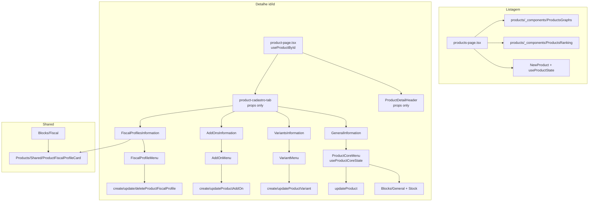

# Plano de refactor — Frontend do módulo de Produtos

> **Documento temporário** para alinhar nomenclatura, arquitetura e ordem de execução.  
> Contexto: migração da aba cadastro, remoção de `components/Products/Detail/` e consolidação dos padrões de edição.

---

## 1. Terminologia adotada

### Problema

Precisamos de um nome claro para o fluxo que edita **somente a linha da tabela `products`** (dados gerais, preços, estoque, imagem de capa) — sem variantes, adicionais ou perfis fiscais.

`ControlPartialProduct` não comunica bem esse escopo e hoje carrega tabs/modal monolítico incompleto.

### Decisão de naming

| Conceito                      | Nome                         | Onde fica                                                        |
| ----------------------------- | ---------------------------- | ---------------------------------------------------------------- |
| Menu de edição da tabela base | **`ProductCoreMenu`**        | `components/Modals/Products/Core/ProductCoreMenu.tsx`            |
| State hook simplificado       | **`useProductCoreState`**    | `state-hooks/use-product-state.tsx` (exportado no mesmo arquivo) |
| Schema Zod do estado          | **`ProductCoreStateSchema`** | idem                                                             |
| Tipo inferido                 | **`TProductCoreState`**      | idem                                                             |

**Por que “Core”?**

- Diferencia o registro principal (`products`) das entidades filhas (variantes, adicionais, fiscal).
- Evita ambiguidade com `ProductMenu` (soa como “produto inteiro”).
- Mantém paralelo com os outros menus por entidade: `VariantMenu`, `AddOnMenu`, `FiscalProfileMenu`, **`ProductCoreMenu`**.

**Regra mental:**

> **Core** = campos da tabela `ampmais_products`.  
> **Child entities** = tabelas relacionadas, cada uma com menu + mutation própria.

### O que entra no Core State

Campos espelhados de `ProductSchema` (sem `organizacaoId`), mais `imagemCapaHolder`:

- `nome`, `codigo`, `unidade`, `grupo`, `ncm`
- `precoCusto`, `precoVenda`
- `rastreamentoEstoqueAtivo`, `quantidade`
- `imagemCapaUrl` + `imagemCapaHolder`

**Fora do Core State:** `productVariants`, `productAddOns`, `productFiscalProfiles`.

### API de mutation

- **`updateProduct`** (`PUT /api/products?id=`) — payload enxuto só com campos do produto base.
- Upload de imagem continua no handler do menu (mesmo padrão de `NewProduct` / `VariantMenu`).

---

## 2. Modelo arquitetural final

### Dois paradigmas, dois contextos (intencional)

| Contexto                        | Paradigma             | State                        | Mutation                            |
| ------------------------------- | --------------------- | ---------------------------- | ----------------------------------- |
| **Criação** (`NewProduct`)      | Monolítico            | `useProductState`            | `createProduct` (payload nested)    |
| **Edição na página de detalhe** | Granular por entidade | hook específico por entidade | mutation específica por sub-recurso |

### Hierarquia de componentes de formulário

```
Blocks/          → átomos (campos puros, sem fetch, sem ResponsiveMenu)
  General.tsx    → passa a tipar com TProductCoreState (não TUseProductState completo)
  Stock.tsx      → idem

Core/
  ProductCoreMenu.tsx   → compõe General + Stock + mutation updateProduct

Variants/
  VariantMenu.tsx       → compõe blocos de variante + mutation

AddOns/
  AddOnMenu.tsx

FiscalProfiles/
  FiscalProfileMenu.tsx

NewProduct.tsx   → compõe Blocks + useProductState (criação bulk)
```

**Regra:** não manter dois formulários paralelos para a mesma entidade.  
`ProductCoreMenu` reutiliza `Blocks/General` e `Blocks/Stock`; não duplicar campos.

### Shared cross-cutting

Permanece em `components/Products/Shared/` (usado por página **e** modais):

- `ProductFiscalProfileCard.tsx` (+ `TProductFiscalProfileCardData`)

---

## 3. Estrutura de pastas alvo

```
app/dashboard/commercial/products/
├── page.tsx
├── products-page.tsx
├── _components/                          # NOVO — colocated com listagem
│   ├── ProductsGraphs.tsx                # migrado de components/Products/
│   └── ProductsRanking.tsx               # migrado de components/Products/
└── id/[id]/
    ├── page.tsx
    ├── product-page.tsx                  # owner do fetch único
    ├── product-cadastro-tab.tsx          # recebe product via props
    ├── product-stats-tab.tsx
    └── _components/
        ├── ProductDetailHeader.tsx       # presentacional (sem fetch)
        ├── GeneralInformation.tsx
        ├── VariantsInformation.tsx
        ├── AddOnsInformation.tsx
        └── FiscalProfilesInformation.tsx

components/Modals/Products/
├── NewProduct.tsx
├── Core/
│   └── ProductCoreMenu.tsx               # substitui ControlPartialProduct.tsx
├── Blocks/
│   ├── General.tsx
│   ├── Stock.tsx
│   ├── Variants.tsx
│   ├── AddOns.tsx
│   └── Fiscal.tsx
├── Variants/VariantMenu.tsx
├── AddOns/AddOnMenu.tsx
└── FiscalProfiles/FiscalProfileMenu.tsx

components/Products/
└── Shared/
    └── ProductFiscalProfileCard.tsx

state-hooks/
└── use-product-state.tsx
    ├── useProductState          → criação bulk (mantém)
    ├── useProductCoreState      → NOVO
    ├── useProductVariantState   → mantém
    ├── useProductAddOnState     → mantém
    └── useProductFiscalProfileState → mantém
```

### Arquivos a remover após migração

| Arquivo                                                | Motivo                                      |
| ------------------------------------------------------ | ------------------------------------------- |
| `components/Modals/Products/ControlPartialProduct.tsx` | Substituído por `ProductCoreMenu`           |
| `components/Products/ProductsGraphs.tsx`               | Movido para `app/.../products/_components/` |
| `components/Products/ProductsRanking.tsx`              | idem                                        |
| `components/Products/ProductFilterMenu.tsx`            | Sem imports no projeto                      |
| `components/Products/ProductsFilterMenu.tsx`           | Sem imports no projeto                      |

---

## 4. Fetch único na página de detalhe

### Situação atual

- `ProductDetailHeader` → `useProductById`
- `product-cadastro-tab` → `useProductById` (de novo)
- `ProductCoreMenu` (futuro) → poderia fetchar de novo ao abrir

React Query deduplica, mas gera loading states independentes e complexidade desnecessária.

### Alvo

```tsx
// product-page.tsx
const { data: product, queryKey, isLoading, isError, error } = useProductById({ id });

if (isLoading) return <LoadingComponent />;
if (isError) return <ErrorComponent ... />;
if (!product) return null;

return (
  <>
    <ProductDetailHeader product={product} />
    <Tabs ...>
      <ProductCadastroTab product={product} queryKey={queryKey} ... />
      <ProductStatsTab productId={id} enabled={...} />
    </Tabs>
  </>
);
```

### Contrato dos filhos

| Componente            | Props                                                                                  |
| --------------------- | -------------------------------------------------------------------------------------- |
| `ProductDetailHeader` | `product: TGetProductsOutputById`                                                      |
| `ProductCadastroTab`  | `product`, `queryKey`, session props                                                   |
| `*Information`        | `product: TGetProductsOutputById`, `callbacks`                                         |
| `ProductCoreMenu`     | `productId`, `initialProduct` (slice core) ou hidrata via prop — **sem fetch próprio** |

Invalidação: `product-cadastro-tab` continua centralizando `cancelQueries` / `invalidateQueries` via `queryKey` repassado.

---

## 5. Implementação do `ProductCoreMenu`

Substitui `ControlPartialProduct` em `GeneralInformation`.

### Comportamento

1. Recebe `productId`, `closeMenu`, `callbacks?`, e dados iniciais (ou `product: TGetProductsOutputById` para mapear).
2. `useProductCoreState({ initialState: mapProductToCoreState(product) })`.
3. Compõe `ProductStateGeneralBlock` + `ProductStateStockBlock` (sem tabs).
4. `actionFunction`:
   - upload de `imagemCapaHolder` se houver arquivo
   - `updateProduct({ productId, product: { ...campos core } })`
5. `onSuccess` → toast + `closeMenu` + invalidate queryKey do pai.

### Mapper local (exemplo)

```ts
function mapProductToCoreState(product: TGetProductsOutputById): Partial<TProductCoreState> {
	return {
		nome: product.nome,
		codigo: product.codigo,
		unidade: product.unidade,
		grupo: product.grupo,
		ncm: product.ncm,
		precoCusto: product.precoCusto,
		precoVenda: product.precoVenda,
		rastreamentoEstoqueAtivo: product.rastreamentoEstoqueAtivo,
		quantidade: product.quantidade,
		imagemCapaUrl: product.imagemCapaUrl,
		imagemCapaHolder: { file: null, previewUrl: null },
	};
}
```

### Refactor dos Blocks

`Blocks/General.tsx` e `Blocks/Stock.tsx` passam a aceitar:

```ts
product: TProductCoreState;
updateProduct: TUseProductCoreState["updateProduct"];
updateProductImageHolder: TUseProductCoreState["updateProductImageHolder"];
```

`NewProduct` continua usando `useProductState`; internamente `state.product` já é compatível estruturalmente — ajustar tipos para união ou extrair tipo compartilhado `TProductCoreFields`.

---

## 6. Hook `useProductCoreState`

### Assinatura (seguindo convenções do projeto)

```ts
export const ProductCoreStateSchema = ProductSchema
  .omit({ organizacaoId: true })
  .extend({ imagemCapaHolder: ... });

export type TProductCoreState = z.infer<typeof ProductCoreStateSchema>;

export function useProductCoreState({ initialState }: { initialState?: Partial<TProductCoreState> }) {
  // state, updateProduct, updateProductImageHolder, redefineState, resetState
}
```

### Quando usar qual hook

| Hook                           | Usar quando                                           |
| ------------------------------ | ----------------------------------------------------- |
| `useProductState`              | `NewProduct` — criar produto + filhos num único POST  |
| `useProductCoreState`          | `ProductCoreMenu` — editar linha da tabela `products` |
| `useProductVariantState`       | `VariantMenu`                                         |
| `useProductAddOnState`         | `AddOnMenu`                                           |
| `useProductFiscalProfileState` | `FiscalProfileMenu`                                   |

---

## 7. Plano de execução (PRs sugeridos)

### PR 1 — Fundação: Core State + ProductCoreMenu

- [ ] Criar `ProductCoreStateSchema` + `useProductCoreState` em `use-product-state.tsx`
- [ ] Criar `components/Modals/Products/Core/ProductCoreMenu.tsx`
- [ ] Refatorar `Blocks/General.tsx` e `Blocks/Stock.tsx` para tipos do Core
- [ ] Substituir `ControlPartialProduct` por `ProductCoreMenu` em `GeneralInformation.tsx`
- [ ] Remover `ControlPartialProduct.tsx`
- [ ] Garantir submit funcional (`updateProduct` + upload + invalidate)

**Critério de aceite:** editar descrição/preço/estoque na aba cadastro persiste e atualiza a UI.

---

### PR 2 — Fetch único no detalhe

- [ ] Mover `useProductById` para `product-page.tsx`
- [ ] `ProductDetailHeader` → presentacional (`product` prop)
- [ ] `product-cadastro-tab` → recebe `product` + `queryKey` (remove fetch próprio)
- [ ] Ajustar `ProductCoreMenu` para receber product/core slice via props (sem fetch)
- [ ] Remover `console.log` de debug em `VariantsInformation.tsx`

**Critério de aceite:** um único loading na página de detalhe; header e cadastro renderizam juntos.

---

### PR 3 — Colocation da listagem

- [ ] Criar `app/dashboard/commercial/products/_components/`
- [ ] Mover `ProductsGraphs.tsx` e `ProductsRanking.tsx`
- [ ] Atualizar imports em `products-page.tsx`
- [ ] Remover arquivos antigos em `components/Products/`
- [ ] Remover `ProductFilterMenu.tsx` e `ProductsFilterMenu.tsx` (dead code)

**Critério de aceite:** listagem funciona; nenhum import de `components/Products/ProductsGraphs`.

---

### PR 4 — Consolidação Blocks/Menus (opcional, pós-estabilização)

- [ ] Auditar duplicação entre `Blocks/Variants` vs campos em `VariantMenu`
- [ ] Extrair sub-blocos reutilizáveis onde fizer sentido
- [ ] Documentar contrato Blocks → Menus no código ou em doc permanente
- [ ] Avaliar split de `product-stats-tab.tsx` (~1100 linhas)

---

## 8. Diagrama final



---

## 9. Checklist pós-refactor

- [ ] Zero referências a `ControlPartialProduct`
- [ ] Zero referências a `components/Products/Detail/`
- [ ] `components/Products/` contém apenas `Shared/`
- [ ] Cada entidade filha tem exatamente um menu de edição na página de detalhe
- [ ] `useProductState` usado **somente** em `NewProduct`
- [ ] Tipos de formulário importados de hooks/schemas, não duplicados inline

---

## 10. Decisões em aberto (baixa prioridade)

1. **`ProductCoreMenu` vs `EditProductCoreMenu`** — mantemos `ProductCoreMenu` por simetria com `VariantMenu` (substantivo + Menu, sem prefixo Edit/New/Control).
2. **Extrair `use-product-core-state.tsx`** para arquivo separado se `use-product-state.tsx` ficar grande demais após o Core State.
3. **Promover este doc** para doc permanente em `docs/dev-planning/` após execução, ou arquivar/remover.

---

_Gerado em: 2026-05-27 — refactor pós-remoção de `components/Products/Detail/`._
